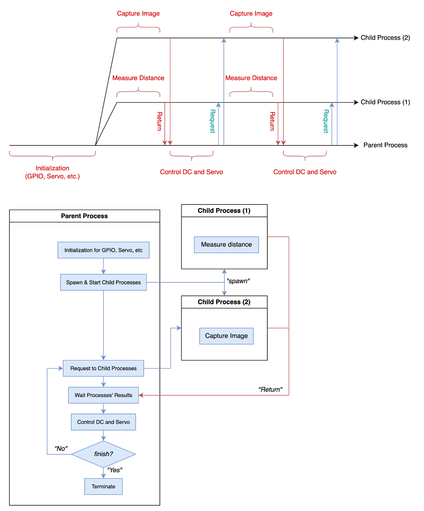

# MultiTasks: A High-level Multiprocessing Framework
Provided by *H.W. Park*

## How to Use
1. `MultiTasks`
```
from multi_tasks import MultiTasks

def test_A(a, b):
    # TODO Something
    return a + b

def test_B(a, b):
    # TODO Something
    return a + b

class TestObject:
    def __init__(self):
        self.a = 2

    def execute(self, b):
        # TODO Something
        return self.a + b

if __name__ == "__main__":
    test_object = TestObject()

    multi_tasks = MultiTasks()
    multi_tasks.register(test_A)
    multi_tasks.register(test_B)
    multi_tasks.register(test_object.execute)

    multi_tasks.start() # Spawn child processes!

    out = multi_tasks( (1, 2), (3, 4), (8,) )
    print(out) # [3, 7, 10]
    multi_tasks.join() # Terminate child processes!
```
2. `Task`
```
from multi_tasks import Task

def test_A(a, b):
    # TODO Something
    return a + b

if __name__ == "__main__":
    test_object = TestObject()

    task = Task(task=test_A, name=None, timeout=None)
    task.start() # Spawn child process!

    out = task.sync_(1, 3)
    print(out) # 4

    task.async_(2, 5)
    parent_out = 10 + 2
    out = task.wait_()
    print(out, parent_out) # 7, 12

    task.join() # Terminate child process!
```


## How to Apply


