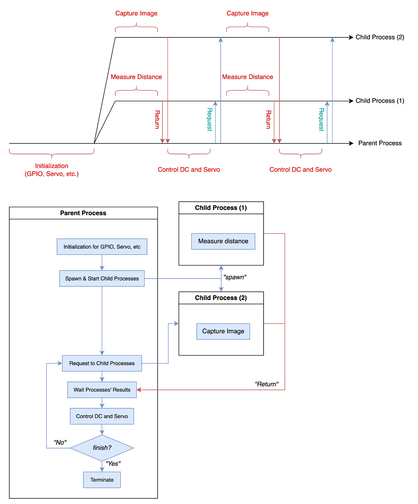

# MultiTasking: A High-level Multiprocessing Framework
Provided by *H.W. Park*   
> **NOTE**:   
> If you have any problems, please feel free to contact me.

## How to Use
1. [`MultiTasking`](./__init__.py) and example code in [here](../test/test_tasks.py).
```
from multitasking import MultiTasking

def test_A(a, b):
    # TODO Something
    return a + b

def test_B():
    # TODO Something
    return 2

class TestObject:
    def __init__(self):
        self.a = 2

    def execute(self, b):
        # TODO Something
        return self.a + b

if __name__ == "__main__":
    test_object = TestObject()

    multi_tasks = MultiTasks.registers(
        test_A,
        tast_B,
        test_object.execute
    ) # Spawn child processes!

    out = multi_tasks( (1, 2), None, (8,) ) # Run 3 tasks in parallel!
    print(out) # [3, 2, 10]

    multi_tasks.join() # Terminate child processes!
```
2. [`Task`](./_task.py) and example code in [here](../test/test_task.py).
```
from multitasking import Task

def test_A(a, b):
    # TODO Something
    return a + b

if __name__ == "__main__":
    test_object = TestObject()

    task = Task(task=test_A) # Spawn child process!

    out = task.sync_(1, 3)
    print(out) # 4

    task.async_(2, 5)
    parent_out = 10 + 2
    out = task.wait_()
    print(out, parent_out) # 7, 12

    task.join() # Terminate child process!
```


## How to apply to your project; Guideline code in [here](./guideline.md).


